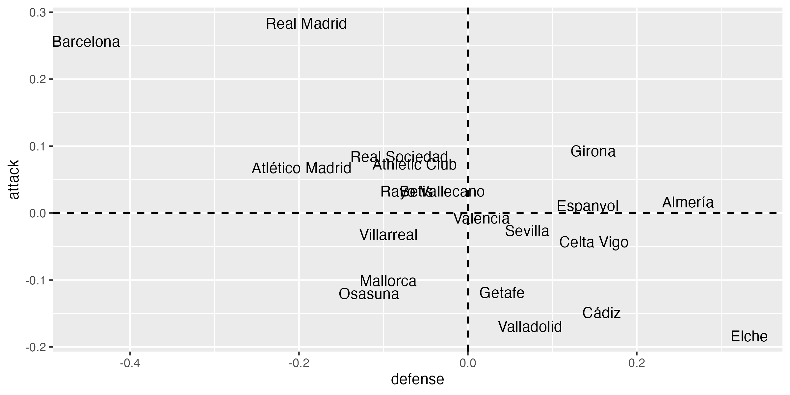
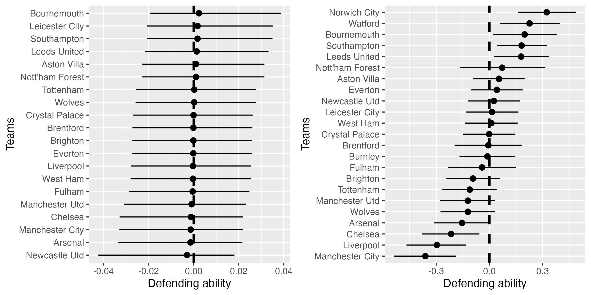
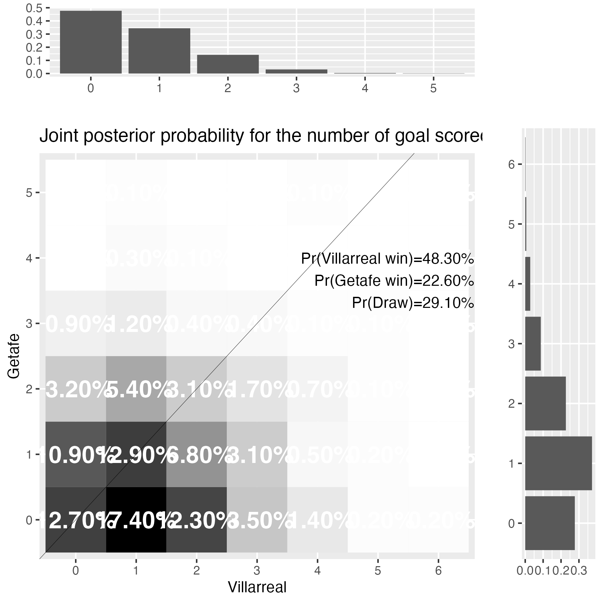
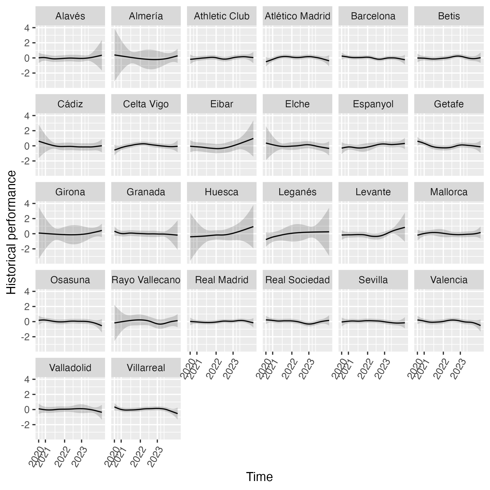

```{r setup, include=FALSE}
knitr::opts_chunk$set(echo = TRUE)
library("ggdag")
library("igraph")
library("tidyverse")
library("knitr")
library("ggdag")
```

 Planning:


Intro:
 - Bakgroound
 - Research Quesion
 - Introduction to statistical methods: A Literature Review
 - Hierarchical Modelling
 - introducing r inla packages
 - report structure
 
Introduction to data:
 - Data description: Domestic League Data
 - Data preperation
 - Covariates
 
Exploratory Data Analysis: EDA
 -
 -
 -
 -
 
Model Building: Bayesian Hierarchical Modelling
 -
 -
 -
 -

Model Checking:
 - Model validation
 

Discussion:
 - Conclusion
 - Limitation
 - Future Work
 
 

# Introduction

## Background and Motivatoin

In 2021 many of Europe's most  prominent and successful Association Football teams engaged in discussions that led to the development of the 'European Super League' (ESL).
The Super League was spearheaded by it's 12 founding members from 4 of Europe's top 5 leagues including the biggest names in football worth billions of dollars on their own such as Manchester United, Real Madrid, Barcelona.
The competition proposed to create a new international standard of Football with aim of providing a more sustainable and lucrative business model for the associated clubs as a direct competitor to the existing UEFA  Champions League.
The Super League was conceptualised as a closed competition; implying that the founding members would be guaranteed permanent membership and exemption from relegation regardless of their performance in a season. With 20 teams in total, this would mean only the 12 founding members were guaranteed to enjoy the expected revenues from the competition, while the 8 others faced a constant threat of relegation. Another aim of the league was to maintain a more competitive balance, in the sense that the league would only contain games of the highest quality from Europe's Best. The founders believed this would retain a larger global audience, thus increasing the value of broadcasting rights, sponsorship and merchandise sales. The organisers also proposed the reduction of financial disparities with the rest of European football by proposing to share a proportion of the revenue generated with other clubs and investing in grassroots football development.

However, following the announcement April 18th 2021, the organizers and teams faced vast backlash among the various stakeholders of the football community, including fans, football governing bodies, domestic leagues, smaller clubs, and even governments.  
The proposed Super League marked a significant  departure from the traditional format of European Football, causing concern from European and Global football's governing bodies; UEFA and FIFA, as well as governments including the UK government, with prime minister at the time Boris Johnson threatening to consider what he labelled as a "legislative bomb" . Critics argued the closed format would lead to the erosion of sporting merit and integrity, many fearing the superior ESL would damage the structure of Europe's domestic leagues, given that the resources of the founding clubs would shift to the new competition, devaluing the domestic leagues as a result and thus widening the financial gap. This concentration of wealth and power was argued to making it more difficult for smaller clubs to compete hence threatening their long term survival.
While the reader may not believe this to be of vital concern as other matters, it must be considered that the competition alone was expected to generate Four billion euros , and Europe's top 5 leagues already generating billions of euros alone, notably the Premier League with €5.492 billion. Thus there are billions of euros at stake with the proposition of this new competition, with many subsidiary industries such as sports betting, analytics, and sponsorships that could be affected.
So, it is of our interest to investigate what may potentially have occurred as a result of this possible intervention in the world of football, with Juventus, Barcelona, and Real Madrid still yet to withdraw from the competition's establishment, there is still a possibility for the European Super League's fruition into reality. With the 12 founding members leaving their respective leagues, and other clubs such as Paris Saint Germain (Ligue 1, France) potentially leaving theirs, one might consider how this would effect the state of the domestic league should they not participate, who would take crown in each of the top 5 leagues?


##  Research Question

This project aims to explore and analyse the predicted performance of European teams in their respective domestic leagues  by modelling and analyzing a range of factors yet to be discussed. In addition, we will use the resulting methodology and analysis to estimate and discuss the hypothetical outcomes in a scenario where 12 clubs have been excluded from participating in their leagues.
This exclusion will have a significant impact on the outcome of the leagues,  and in reality would have various potential ripple effects on the teams, competitions, and industries as a whole. By conducting a thorough analysis and exploring the potential outcomes, we hope to provide valuable insights into the current state of European football and the potential impact of excluding certain clubs from participation.
In doing this we hope to explore statistical techniques that can be used to model and predict the outcome of match results. We will look at the recent scope of literature on statistical techniques that have been used in the prediction of match results.

## Introduction to statistical methods: A Literature Review

### A Brief History

The prediction of football match results has been of interest to researchers and statisticians for decades. The use of binomial and negative binomial models were explored as early as 1968 by Reep and Benjamin in their paper "Skill and Chance in Association Football", before the Poisson distribution became the prominent method of modelling these relevant quantities. Many cite and credit Maher (1982) who successfully demonstrated the uses of Poisson Modelling,later addressing the relation between teams in a given match through  Bivariate-Poisson modelling.
One of the most influential studies in the field came from the work of Dixon and Coles (1997) who proposed a far more effective Poisson Model framework. In their study they introduced further improvements with time-weighting factors and correction terms for low-scoring matches. Their method demonstrated improved accuracy over previous models and has been widely reference in subsequent research.

### Bayesian framework:
Bayesian frameworks have gained popularity over recent years due to their ability to incorporate prior knowledge and ability to update probabilities based on newer data, providing promising results with their predictive capabilities.
Extensions of the Bayesian framework include the Bayesian generalised linera model of Rue and Salvesen (2000), which has been widely referred to in subsequent research. The framework was later improved by the promising Hierarchical Bayesian Models of Gianluca Baio in his 2010 and 2018 papers (Baio et al.,2010) (Baio et al., 2018). Baio's contributions have been significant to the field of statistical methods in football match modelling. The 2010 paper introduced a multilevel structure in their modelling to estimate team-specific parameters nested within a mixed effects model, applied in the context of the Italian Serie A league. They also later specified a more complex mixture model that aimed to overcome the issue of over shrinkage produced by the Bayesian multilevel model, in order to provide a better fit to the data of previous season. Baio later made further improvements to this area of the Bayesian framework in his 2018 paper incorporating even more complex and effective mixture models accounting for the data available at the time. His works have been widely cited in later literature, including comprehensive reviews of Bayesian statistical methods in football (Santos-Fernandez et al., 2019) and studies of more modern techniques (Hubáček et al., 2019).
The Bayesian Hierarchical Model demonstrates advantages by naturally accounting for relations between variables through the assumption that they come from a common distribution.
Overall this approach enables the effective and comprehensive account of team performance while accounting for the hierarchical structure of football league  data.
More recent research using Bayesian frameworks include that of Razali et al (2017) exploring the use of machine learning methods, in this case Bayesian Networks (BNs) to model, predict, and validate match results for the English premier League. Other recent applications have included Naive Bayes and Tree Augmented Naive Bayes Models in Rahmanet et al. (2018),


### Other methods

Although Bayesian methods have become more prominent in the field of predictig football results in recent years, other methods have also been observed. In the past Bradley-Terry models (Bradey and Terry 1952) with comparison modes pairing teams to determine the outcome of a game (Kuk 1995) have been used to estimate the probabiliies of winning, drawing, or losing a match. Related studies in the field include Godin et al's  (2014) leveraging of contextual information via "Twitter Microposts" and machine learning techniques in order to comprehensively beat expert and bookmaker predictions, a dynamic approach wit a different end goal to the purpose of our study. Furthermore, other more relevant and modern research cover Machine Learning Methods such as Random Forests (Groll et al. , 2018), Gradient Boosting and Linear Support Vector Machines, notably by Baboota et al. (2018) who's work has been well cited as developments in the use of Artificial Intelligence and Machine Learning methods continue to develop in this field.

As we can observe, the aims of the papers discussed in the literature review vary. Some aim to simply model the outcome of the came like in Fahrmeir and Tutz (1994) using models of paired data with time varying features. Others investigate outcomes by predicting goals scored as seen in Dixon and Coles 1997 and Baio et al. (2010, 2018) while others address other characteristics used to predict outcomes, such as passing movements and shots per game see Reep et al (1968).


## Introduction to Bayesian Hierarchical modelling


For the purpose of this study regarding statistical modelling in the prediction of football outcomes, we will be predicting outcomes of the top five European domestic leagues utilising the Bayesian Hierarchical Model (BHM).

(Need to expand on why?)
By adding many degrees of hierarchy, BHM enables the representation of complicated relationships and structures within the data. This strategy is based on the Bayesian probability theory discussed above, which offers a methodical manner to revise beliefs or probabilities in light of new information by applying the Bayes' theorem.

The framework used in BHM adopts a

From Bayesian Inference theory we know:


$$P(\theta ,y)=P(\theta)P(y\mid \theta)$$   is the joint probability distributions for  $\theta$ and y, written as the product of the distributions:
- the prior distribution $P(\theta)$, which estimates the parameter  $\theta$ before data is observed
- the sampling distribution $P(y\mid \theta)$ , referred to as the Likelihood; the distribution of observed data conditional on $\theta$ .

Using Bayes Theorem:

$$P(\theta\mid y) = \frac{P(\theta,y)}{P(y)} = \frac{P(y\mid \theta)P(\theta)}{P(y)}$$
Where $P(\theta\mid y)$ represents the posterior distribution of the parameter $\theta$ given observed data .$P(y)$ reflects the marginal likelihood, or model evidence, that is derived as the integral of the  joint probability distribution of $\theta$ and y:

$$ P(y) = \int P(\theta)P(y\mid \theta) d\theta$$
In scenarios where the marginal likelihood is not easily obtained, one may express the  posterior distribution  as:
$$P(\theta\mid y) \propto P(y\mid \theta) P(\theta) $$

Hierarchical Models:

The extension of the Bayesian framework into hierarchical modelling incorporates two added features used in deriving the posterior distribution:
- Hyperparameters: set of parameters that are used to determine prior distributions of other parameters uesd in the model often referred to as lower level parameters. The hierarchical nature of BHM allows for multiple levels, each level having its own distribution. Parameters at the higher levels are used to determine properties of the priors for lower-levels, which are the hyperparameters.
- Hyperpriors: these are the prior distributions on the hyperparameters,  used to express uncertainty in a hyperparameter.

The framework of the BHM:
We consider the structure of a two level Bayesian Hierarchical Model
let y be a set of obesrvations $y_1,...,y_n$ from random variables $Y_1,...,Y_n$ and $\theta$ be the set of parameters from each Y_i; $\theta_1,...,\theta_n$ from a common population with distribution determined by hyperparameter $\phi$


The Likelihood above is $P(y\mid\theta,\phi)$ with $P(\theta,\phi)$ as its prior distribution.

$$\text{Stage 1: }y\mid\theta,\phi \sim P(y\mid\theta,\phi)$$

The prior can be expressed as $P(\theta,\phi) = P(\theta\mid\phi)P(\phi)$ using the definition of conditional probability

$$\text{Stage 2: }\theta\mid\phi \sim P(\theta\mid\phi)$$
The next stage being the hyperparameter: $\phi$  with prior distribution $P(\phi)$ , referred to as the hyperprior.

$$\text{Stage 3: } \phi \sim P(\phi)$$

Using this structure we obtain the posterior distribution using bayes theorem, expressed as:
$$P(\phi,\theta\mid y)  \propto P(y \mid\theta,\phi) P(\theta,\phi) = P(y\mid\theta ) P(\theta \mid\phi ) P(\phi)$$
Using this we can obtain probabilities from the posterior distribution.

## The R-INLA package:

In surrounding literature regarding BHM theory, various languages  are used for modelling including R, Jags, Python, Stan (Hilbe et al., 2017), with popular related  studies such as Baio et al.'s paper (2010) addressing the use of WinBugs software. Here they used standard Markov Chain Monte Carlo (MCMC) methods that were used to generate samples from the posterior distribution. However this particular method requires a large number of iterations in order to converge, which computationally is incredibly intensive and time consuming as the number of samples needed increases. Although MCMC methods are able to handle very complex and dynamic models that include a large amount of parameters making it flexible in the modelling process, for the purpose of this particular study it raises questions as to whether it is optimal or necessary.

Instead we will consider the R-INLA package, as used in Baio et al.'s 2018 paper for football prediction modelling. The package refers to the Integrated Nested Laplace Approximation (INLA). This method is far more computationally efficient compared to MCMC techniques used in fitting Bayesian Models, particularly those with latent Gaussian Structures such as Gaussian processes and grouped random effect models. Using a combination of analytic approximations and numerical integration with posterior densities, the obtained posteriors can be use to get posterior expectations and quantiles. Thus, in hope of being able to efficiently and effectively  generate many models along with their predictions for the different leagues we will use the INLA package going forward.

## Report Structure

In the next chapter of the report we will introduce and inspect the data that will be used to determine the outcome of the domestic leagues. We then go onto introduce main concepts of the model building process, before discussing the results obtained along with any limitations and future outlook on the research.


# Introducing the Data

## Fbref Datasets

Data of the top 5 leagues are available from a vast array of sources, and we select Fbref because of its comprehensive and well structure format of each league, While providing insightful information on characteristics such as individual player statistics, and complex measures of performance including pass progression types and expected goals, which may be considered for more complex models. Fbref provides the data for each league in the same format, and unlike other sources splits the fixtures for each team into rounds, making it very useful when predicting and updating posterior probabilities for each round as the leagues progress in time. Fbref gives access to multiple seasons in time for each league, which also gives rise to the possibility of using these past seasons in the modelling process.

## Data Description

The initial Fbref fixture dataframes include fixture lists of 380 games for leagues with 20 teams; Premier Leage, La liga, Ligue 1, and Serie A, while Bundesliga has 18 teams and thus 306 games in a season. They provide information  on "Wk"; the round that a particular fixture belongs to, Date, Home Team, Away Team, Score, Venue, and other variables that were not included in the final dataframe, namely; xG, Attendance, Referee, as these would not be able to be reproduced every round of prediction.

## Data preperation

We then clean the data handling any missing values and correcting any inconsistencies, particularly in the case of Premier league data. There are 38 rounds of fixtures for each team in all leagues apart from Bundesliga where there are 34. However in some cases there are rounds that are rescheduled thus creating double game weeks and other conflicts, and so in the case of the Premier League the number of rounds has been adjusted so there are 44 rounds to avoid any conflicts making predictions more effective in the long run. We do this and other data preparation steps using the tidyverse set of packages in r, particularly dplyr and tibble.
We first order the data in order of data, adding  ID_game indicating the number of the specific fixture out of the 380 that are to be played.  The input data is converted into long format by duplicating the rows of each fixture for a home and away team row, adding a binary variable Home, 1 if the team in the row of a given fixture is Home and 0 if away. The Opponent variable was created grouping data by ID_game and assigning each team's opponent as necessary. The Venue variable is adjusted instead of being the stadium name, to the name of the team it belongs to; "Old Trafford" becomes "Manchester Utd". We then create the following variables that are to be used in the Bayesian Hierachical modelling processing:


| Variable | Description |
|---|---|
| Goal | Number of goals scored by the specific team in a given fixture (this will be our response) |
| Points Won | Points Gained after each fixture, 3 for Win, 1 for Draw, 0 for Loss |
| Days Since Last Game | Number of days since the last fixture played by the specific team |
| Total Points | Cumulative points acquired by each team after accounting for the points won in the specific game |
| Points Difference | Difference in points between the 2 teams for each fixture |
| Relative Strength | Weighted value of total points between 2 teams of each fixture |
| Form | proportion of points won in the last 5 games, i.e x points out of the possible 15 |
| Goals per game (Gpg)) | Amount of goals a team has scored per game |
| Goals Conceded (GC) | Amount of goals the opponent scored against a specific team |
| Goals Conceded Per Game(GCpg) | Amount of goals the opponent scored against a specific team per game|
| Goal Difference (GD) | Difference between the goals scored and concede in a given game |
| Total Goals Scored (TG) | Cumulative total of goals scored in all games played after given game |
| Total Goal Difference (TGD) | Total Goal Difference (Total Goals Scored - Total Goals Conceded) |
| Goal Difference-Difference (TGDDiff) | Difference in the totalgoal difffernece between the teams of a fixture |
| Rank | The league position of a team at any given game week, (1 to 20), decided by goal difference if tied |
| Rank Difference | Difference in league position of teams for each fixture |


# Exploratory Data Analysis

##

##

##

##

##


# Model Building

## Baseline Model

Given the literature in the field of football modelling, we follow suit assuming the number of goals scored by a team in a given fixture follows the Poisson Distriubtion (Maher 1982,  Rue and Salvesen 2000, Baio et al. 2010).

Such a model takes the form:

$$Y_i \sim Poisson(\lambda_{1i}) $$
$$X_i \sim Poisson(\lambda_{2i}) $$
where $X_i$ and $Y_i$ are goals scored by home and away teams respectively in game i, and $\lambda_{2i}$ and $\lambda_{2i}$ are the respective parameters that are the measures of the scoring intensities.

In sports modelling the use of log linear random effect modells for the parameters $\lambda_{1i}$ and $\lambda_{2i}$ is common (Karlis et al. 2003). We establish a simple baselime log linear effects model:

$$log(\lambda_{1i}) = \beta_0 + \beta_1 home + att_{h_i} + def_{a_i}  $$

$$log(\lambda_{2i}) =  B_0 + att_{a_i} + def_{h_i}$$
Here i=1,2,...,n where n is the number of matches played in a season, i.e. n=380 for Premier League, Ligue 1, La Liga, and Serie A, whereas n = 306 for Bundesliga. Home reflects the fixed effect parameter when a team plays at their own Venue, evidently not appearing in the Away scoring parameter model. The 'att' and 'def' random effects reflect the relative attacking and defensive capabilities of a given team. Thus for the Home scoring Parameter, the model uses the attack effect of the home team and the defensive effect of the away, while for the Away scoring parameter it is modeled using the away attack effect and the home's defense.

In this model we make the assumption that the random effects of individual teams attacking and defending effects are in an exchangeable structure, the order in which the teams appear in the data does not have an impact on the inferences of their individual attacking and defending strengths. For instance the attacking strength of a team A and the defending strength of team B are considered to be drawn from a similar  underlying distribution, regardless of the order they appear in the dataset. The exchangeable structure helps simplify the analysis and pool information across different teams during the season, and the assumption implicitly applies there is some correlation between the attack strength of a given team, and the defense of their opponent, arising since they are in the same game drawn from a similar underlying distribution. In doing this we imply that teams on average are similar in offensive and defensive capabilities, and that any differences are attributed to random variations arising from the common distribution. In our model we assume the effects to be distributed as

$$att_i \mid \sigma_\alpha ~ Normal(0, \sigma^2_\alpha) \\ and \\ def_i \mid \sigma_\beta ~ Normal(0, \sigma^2_\beta)$$

Below is a  representation of the hierarchical structure of the model at hand:

### try something similar to DAG representation that will show a hierarchical strucutre.
```{r DAG, echo=FALSE, message=FALSE, warning=FALSE}
# install.packages("latex2exp")
library(ggdag)


dag <- ggdag::dagify(yi ~ lambda1i,
                     lambda1i ~ home,
                     lambda1i ~ atthi,
                     lambda1i ~ defai,
                     atthi ~ sigmaalpha,
                     defai ~ sigmabeta,
                     xi ~ lambda2i,
                     lambda2i ~ attai,
                     lambda2i ~ defhi,
                     attai ~ sigmaalpha,
                     defhi ~ sigmabeta)


 ggdag(dag) + theme_dag()


```


Having established the  baseline model's formula, we fit the model using the INLA package, again specifying the poisson distribution for he response variable; number of Goals. Before this we prepare the data initially on a single season for each of the leagues. We first fit the model up to round r for prediction, with rounds 1,..., r-1 having been played already. The starting round number r was determined as the next game week at the time of modelling, in the case of the Premier league: 28, La Liga: 23, Ligue 1: 25, Serie A: 24, and Bundesliga: 22.

The INlA algorithm [Congdon, 2019] focuses on the posterior density of hyperparameters $\pi( \lambda \mid y)$ and on the conditional posterior for the latent $\pi(x_i \mid \lambda , y_i)$ A Laplace approximation for marginal posterior density of random effects' hyperparamters $\tilde{\pi}(\lambda \mid y)$  and Taylor approximation for conditional posterior of latent $\tilde{\pi}(x_i \mid \lambda , y)$ From these approximations, marginal posteriors are obtained, where integrations are carried out numerically.
$$\tilde{\pi}(x_i \mid y_i) = \int \tilde{\pi}(\lambda \mid y)  \tilde{\pi}(x_i \mid \lambda , y)$$
Thus, using our model the predictive distribution will have a probability mass function [Baio et al., 2018]:

$$\tilde{\pi}(\hat{y_1} ,\hat{x_1} \mid y_1 , x_1, z_1, z_2) = \int \tilde{\pi}(\hat{y_1} ,\hat{x_1} \mid z_1 ,z_2,v)  \tilde{\pi}(v \mid y_1 , y_2,  z_1 ,z_2,)$$
Where $\hat{y_1} ,\hat{x_1}$ are the predicted goals scored in a future match, z_1 z_2 are the feature ests used, and v is the vector of all paramaters of the model. Then cases are considered based on the predicted goals scored:

* $\hat{y_1} > \hat{x_1} \therefore$ Home Team wins
* $\hat{y_1} < \hat{x_1} \therefore$ Away Team wins
* $\hat{y_1} = \hat{x_1} \therefore$ Draw
 
\pagebreak

Using values from inla.summary.random we are able to extract the quantiles of the random effects measuring the teams' attacking and defensive strength. Below is a table showing example values of the effects' quantiles:

##### Formatting needed #######
```{r echo=FALSE, message=FALSE, warning=FALSE}
laligaattdef = readRDS("dissolaligaattdef.RDS")

library(kableExtra)
laligaattdef_df <- data.frame(laligaattdef)

kable(laligaattdef_df,
      format = "latex",
      col.names = c("Team", "Attack Mean", "Attack 2.5%", "Attack Median", "Attack 97.5%",
                    "Defense Mean", "Defense 2.5%", "Defense Median", "Defense 97.5%"),
      align = 'c',
      caption = "Example: La Liga Team Attack and Defense Random Effect Quantiles") %>%
  kable_styling(latex_options="scale_down")


```

Below are visual representations for the team attack and defence effects for each of the remained of top 5 leagues, using only data from the 2022/23 seasons. We will discus later how this is impacted when adding more data from previous seasons.

```{r t5 league team_strength plots, echo=FALSE, fig.align='center',out.width = "400px"}
#la liga
include_graphics("llattdef.png")
#ligue 1
include_graphics("l1attdef.png")
#Serie A
include_graphics("saattdef.png")

 
```
Attack and Defense effects on the same grid give an idea of how teams proficient specific teams are at both defending and attacking relative to each other. Consider the case below for La Liga in the 2022/23 season showing by far how Barcelona and Real Madrid are the most outstanding teams, followed by a cluster of "next contenders"; Atletico Madrid, Real Sociedad, and Athletic Club.

```{r echo=FALSE}

```


## Post Processing


Having run the model through INLA, We are then able to generate the predictions for goals scored, by simulating from the posterior distribution for the specific round of matches. Sampling was completed using R-INLA's method: inla.posterior.sample. Taking the input round number, data, model, and number of simulations (default 1000) as inputs, we created a function `make_scored()` that will get the index of corresponding rows. Then the posterior samples of latent variables are obtained using inla.posterior.sample, say $\hat{att_{hi}},\hat{def_{aj}}$ and $\hat{home}$, storing the exponentiated posterior sample values.  Then we compute the predicted scoring intensity paramter by each team in the specific round:

$$\hat{\lambda_{ij}} = \exp(\hat{att_{hi}} + \hat{def_{aj}} + \hat{home} + \text{offset})$$
Finally the function generates the predictions for the  number of goals by simulating from a Poisson Distribution using `rpois()`, with the predicted scoring intensity parameter:

$$goals_{ij} \sim  \text{Poisson} ( \hat{\lambda_{ij}} )$$

The code used in the modelling process includes utility functions  that manipulate, visualise, and simulat from our dataset to generate predictions.

** Prediction Processing:
 * `datprep()` , preps the data of a leagueto be used in our `runINLA()` function. 
 * `runINLA()` , runs the INLA model after specifying the formula, data for given round, posterior family, 
 * `make_scored()` , Processing function create to predict the number of goals scored by a team in a given fixture round.

** Visulisation: 
 * `team_strength()` , Display Only Attack or Defence Defence random effects for teams in a league
 * `attack_defense()` , Display Both Attack and Defence effects on the same plot, from the INLA model summary
 * `outcome_predict()` , gives the predicted probabilities of either winning, losing, or drawing a match.
 * `joint_marginal()` ,  gives the plot of the joint posterior probabilities for specified teams Plots the joint posterior distributions of all the possible scores between two team given the predicted goals from `make_scored()`
 
** Post-Processing 
 * `updated_unplayed()` ,  extracts the unplayed fixtures for a given round and inputs the most common result ( i think this should instead be inputting just the sample mean of the column of goals scored for the team rounded?)
 * `update_footie()` , updates the premfootie dataset with the goal predictions
 * `var_updater()` ,  updates the other variables in the dataset as a result of the goal predictions
 * `roundNinla()` , streamlines the simulating process, by completing all of the above 3 post-processing for a given round N , e.g round 24


### Outcome predictions:

Running inla.summary we are able to extract coefficients for estimates of our models fit. For example in the case of baseline model applied to Serie A;


```{r echo=FALSE, message=FALSE, warning=FALSE}
exampleinlaserie = readRDS("mseriesum.rds")
exampleinlaserie$fixed  %>% data.frame()  %>% select(mean) %>% kable(caption = "Serie A Fixed Effects; only 2022-2023 Seasons")
exampleinlaserie$hyperpar %>% data.frame()  %>% select(mean) %>% kable(caption = "Hyperparameter Precision in Serie 2022/23 Season")
```
We see mean values for the intercept and Home fixed effect are 0.088 and 0.213 respectively. Thus the model equation will take the form:
$$\log(\lambda_{ij}) = 0.088 + 0.213{home}_j + {att}_{hi} + {def}_{ai} $$ where

for game g, where:
 * 0.088 is the intercept
 * $0.213home_i$ is the home advantage efffect for home team in game i, 0.213 increase in the log of the scoring paramater used in the poisson model predicting goals scored.
 * ${att}_{hi}$ is the effect for home team of game i
 * ${def}_{ai}$ is the effect for away team of game i

We notice from the model output that the precision for Team factor has a significantly lower precision than opponent factor, indicating noticeable variability in the attack effects, while very little hy  variation for defence effects. Thus the effect of an opponent on a teams goal scoring ability (i.e. a teams ability to defend against a team) has  less impact than the teams innate attacking ability itself.

### Overfitting Concerns - Introduction of Multiple Seasons' Data

The lack of variability accounted for in the model due to overfitting, thus th mode may be capturing the noise rather than the underlying pattern, in this case resulting in the lack of variability in th Opponent random effect. Thus in order to mitigate this concern we include the use of multiple seasons data as opposed to using a single season, that only provides 760 rows of data. With the inclusion of the 2019/20, 2020/21, and 2021/22 along with the 2022/23 seasons, this now results in dataframes with 3040 rows of data for each league.
The effects of overfitting are also demonstrated in the random effect quantile plots, particularly for the Opponent (Defence) factor. Consider the case of the  Premier League, where the magnitude of the effects are considerably small and closely centered around the mean;

```{r echo=FALSE}
#pl comparison single vs all seasons defence effects

```
After adding multiple seasons of data, we see how there is now noticeable variability in the defence effect for all teams. Thus demonstrated how we have mitigated the impact of overfitting by adding more data from multiple seasons. We also see this in the inla.summary output shown below, where the precision for the model hyperparameters are considerably smaller; mean 18194.995 when only using 2022/23 compared to 33.254 for 2019-2023 data.
```{r echo=FALSE}
Mallseaspremsum = readRDS("Mallpremsum.rds")
M2223premsum = readRDS("mprem2223single.rds")

M2223premsum$hyperpar %>% data.frame()  %>% select(mean) %>% kable(caption = "Hyperparameter Precision using only 2022-2023 Season")
Mallseaspremsum$hyperpar  %>% data.frame()  %>% select(mean) %>% kable(caption = "Hyperparameter Precision using 2019-2023 Seasons")
```


## Result Generation
Now that we are able to generate predictions using the inla.posterior.sample method for the number of goals scored for each team after a given round, we are then able to get predicted match outcomes for the selected fixtures. In similar research the use of posterior means or medians is used from both individual team's marginal distribution, however in our modelling we use the most probable outcome from the joint posterior predictive distribution in each fixture, i.e. the most common row outcome between two teams after each n row simulations are complete. 

For instance, using the baseline model in round 23 of the 2022/23 La Liga season, in a match between Villarrael and Getafe. We have the table:

```{r echo=FALSE, message=FALSE, warning=FALSE}
mpotab = readRDS("Villarael v Getafe Example MPO Table")

mpotab = head(mpotab) %>% kable(caption = "Most Probable Outcomes: Villarael v Getafe, Round 23 of La Liga 2022/23") %>% kable_styling(latex_options="hold_position")
mpotab
```
Here 'prop' is the proportion of outcomes with the given result, thus in this case 17.4% of outcomes in the match see Villarrael as victors specifically with a score of 1-0.

We can visually display the joint marginal distribution of goals scored in this specific match, using our created function: `joint_marginal()`.


```{r echo=FALSE, message=FALSE, warning=FALSE}

```

We see the probability of every possible outcome from the joint posterior distribution, along with the overall probability of winning, drawing, or losing found using our created `outcome_predict()` function. The histograms represents the sampled marginal posterior distribution for teams individually, with highest density of 0 goal scored for Getafe (top), and 1 for Villarrael (Right).


After determining the most likely result of relevant  'Goal' column, as well as the associated variables derived from it such as Points , Goal Difference, Relative Strength etc. Although as before these are not used in the baseline model.

In the case of Bundesliga, we calculate the cumulative points determined from goals scored in each game, and derive the league table at the end of the season: We first show the results when using the Mean of each teams predicted goals after n simulations, compared to using the joint predictive posterior distribution. Using means shows Bayern Munich winning the league, where as the most probable outcome from the joint distributions leads to Dortmund winning the league


### Implementation of Other Covariates

We next aim to add covariates to the log linear model estimating the scoring parameter, which follow the form:

Home Goals:

$$log(\lambda_{1i}) = \beta_0 + \beta_1 home + att_{h_i} + def_{a_i} + \sum^m_j\beta_jz_{i1k}$$
where $\sum^m_j\beta_jz_{i1k}$ are the added set of covariates with their effect estimates from the set $\bar{z}= \{ {z_1,z_2,...,z_m} \}$ Similarly for Away Goals;

$$log(\lambda_{2i}) = \beta_0 + att_{a_i} + def_{h_i} + \sum^m_j\beta_jz_{i2k}$$

The set of possible covariates that can be part of the set  $\bar{z}= \{ {z_1,z_2,...,z_m} \}$ are coded as:
* Days Since last Game - `days_since_last`
* Relative Strength - `rel_strength`
* Goals per game - `Gpg`
* Goals conceded per game - `GCpg`
* Total Goal Difference-Difference - `GDdiff`
* Rank Difference - `diff_rank`
* Form - `form`

Note some variable from the dataframe are excluded so to reduce multicollinearity between variables as they are derived from them, such as Total Goals Conceded, instead using goals conceded per game as well as total goal difference. Using this variable we aim to select a set that provides a better fit for predictions. We next consider compare different combinations of covariates in finding the best fit through INLA modelling.


## Model Selection:

Typically in INLA and hierarchical modelling  (Rue et al. 2009), the use of Deviance Information Criterion and Watanabe-Alike-Information-Criterion are use as methods of comparing models in context.
DIC is a model that is analogous to the Akaike information criterion (AIC) used in estimating prediction error, instead measuring the trade off between model fit and complexity calculated as follows:
$$ DIC(\lambda) =  D(\bar{\lambda}) + 2p_D $$
where $D(\bar{\lambda})$ is the deviance at the posterior mean of the parameters and $p_D$ is the effective number of parameters.

Similarly the Watanabe-Akaike Information Criterion is a indicator of singular model performance. As defined by Watanabe himself, (Gelman et al. 2014) WAIC is the "negative of the average log pointwise predictive density and thus is divided by n, and does not have the factor of 2", although in INLA is is scaled by factor of 2 for comparability with DIC and other measures of deviance. DIC makes the assumption that the posterior is approximately multivariate normal, while WAI can be numerically calculated without information on the true distribution. WAIC also an extension of the widely used AIC in the Bayesian context, and also offers the bonus of no need for effective parameters, again unlike DIC. Given the added applicability to general BHM methods, the WAIC is a better indicator of model suitability.

## Optimised Model Formulas for Log Linear Models

### Premier League

Below is a table showing the top 10 models with the lowest WAIC, indicating top 10 most suitable models given the fact that lower WAIC demonstrates desirable lower deviance. Consider the example below of the Premier League, where the formula that results in the lowest WAIC includes added covariates Form, Goals Per Game (Gpc), Goals Conceded Per Game (GCpg), and Goal Difference-Difference between teams (GDdiff).


```{r echo=FALSE, message=FALSE, warning=FALSE}
top10mods = readRDS("allprem_top_10_models.rds") %>% kable(format = "latex",align = 'c',
      caption = "Top 10 Model Combinations By WAIC: Premier League") %>%
  kable_styling(latex_options="scale_down")  %>% kable_styling(latex_options = "hold_position")

top10mods
```
Thus the optimal formula for the Premier League model after this part of the model building process is of the form:

Home Goals in game i:
$$log(\lambda_{1i}) = \beta_0 +  att_{h_i} + def_{a_i} + \beta_1 Home_j + \beta_2 form + \beta_3 Gpg + \beta_4 GCpg +  \beta_5GDdiff$$
Away Goals in game i:

$$log(\lambda_{2i}) = \beta_0 +  att_{h_i} + def_{a_i} + \beta_1 form + \beta_2 Gpg + \beta_3 GCpg +  \beta_4 GDdiff$$


As for the other domestic leagues, the optimised formulae for the log linear models are:
```{r include=FALSE}
readRDS("allligue_top_10_models.rds")
readRDS("allserie_top_10_models.rds")
readRDS("allbuli_top_10_models.rds")
readRDS("alllaliga_top_10_models.rds")
```

### La Liga:
Home Team:
$$log(\lambda_{1i}) = \beta_0 +  att_{a_i} + def_{h_i} +  \beta_1 Home + \beta_2 Gpg + \beta_3 GCpg + \beta_4 GDdiff$$
Away Team:
$$log(\lambda_{2i}) = \beta_0 +  att_{h_i} + def_{a_i} + \beta_1 Gpg + \beta_2 GCpg +  \beta_3 GDdiff$$

### Serie A:
Home Team:
$$log(\lambda_{1i}) = \beta_0 +  att_{a_i} + def_{h_i} +  \beta_1 Home + \beta_2 Gpg + \beta_3 GCpg + \beta_4 GDdiff + \beta_5 Form$$
Away Team:
$$log(\lambda_{2i}) = \beta_0 +  att_{h_i} + def_{a_i} + \beta_1 Gpg + \beta_2 GCpg +  \beta_3 GDdiff + \beta_4 form$$

### Bundesliga:
Home Team:
$$log(\lambda_{1i}) = \beta_0 +  att_{a_i} + def_{h_i} +  \beta_1 Home + \beta_2 Gpg + \beta_3 GCpg + \beta_4 GDdiff$$
Away Team:
$$log(\lambda_{2i}) = \beta_0 +  att_{h_i} + def_{a_i} + \beta_1 Gpg + \beta_2 GCpg +  \beta_3 GDdiff$$

### Ligue 1:
Home Team:
$$log(\lambda_{1i}) = \beta_0 +  att_{a_i} + def_{h_i} +  \beta_1 Home + \beta_2 Gpg + \beta_3 GCpg + \beta_4 GDdiff + \beta_5 diffrank$$
Away Team:
$$log(\lambda_{2i}) = \beta_0 +  att_{h_i} + def_{a_i} + \beta_1 Gpg + \beta_2 GCpg +  \beta_3 GDdiff + \beta_4 diffrank$$
## Aditional Covariate Consideration

We also explore the addition of other covariates that may further improve model performance. First, a time component that aims to address team's difference in performance over time. This is added to the INLA model using `f(id_date,model="rw2",replicate=as.numeric(factor(Team)))`.
A Random Walk model of order 2 `model="rw2"` based on the fixture date variable representing the time component, is computed separately for each team `replicate=as.numeric(factor(Team))`. The effects from the Random Walk over the course of the dates in our dataset (between the start of the 2019 season and end of the 2023 season) are shown in the plot below:

```{r echo=FALSE}

```


Another are of Bayesian Hierarchical Modelling to consider is overdispersion, a common feature in count data like goals scored in football. Overdispersion occurs when variance of the observed data is greater than what would be expected under a simple Poisson distribution, thus we aim to capture extra variability that may not be accounted for with other covariates. This is demonstrated in the code by `f(num,model="iid")` which adds another random effect to the INLA model, based on 'num' which is the unique identifier of every row in the data.

However after adding these variables individually and together, they did not improve model fit by WAIC; adding the random walk time component increased deviation, while adding the overdispersion parameter neither improved or negatively impacts WAIC by a noticeable amount. We note the very high in precision in the model hyperparameters for these added random effects via the summary output, demonstrating the lack of variability that is captured by these covariates. Thus we continue without them.

## Model Validation

In model validation we aim to compare the effectiveness of the more complex 'optimised' model, based off WAIC, and the baseline model. This is executed using all the prior seasons data, with observed data up until halfway through the 2021/22 season. We then simulate the remainder of the 2021/22 seasons for each league, and compare with the observed results of the final league positions for each team. The mean square error of the optimised and baseline model are compared, and we proceed to the 2022/23 modelling based on which model has lower MSE.
Consider the case of the Premier League model validation, the table below shows the predictive performance of the 

```{r echo=FALSE}
readRDS("premcomptabbl2122") %>%
  kable(caption = "Comparing Baseline and Optimised models Performance vs Obesrved") %>% kable_styling(latex_options="scale_down")  %>% kable_styling(latex_options = "hold_position")
```
Using the figures above we are able to calculated the mean squared error for the baseline model and optimised models respectively; 115.55, 100.65 thus demonstrating we have achieved better performance using the  optimised formula in the log linear model for the scoring parameters. The improved performance is consistent with results of Bundesliga, Serie A, and La Liga, all of which had lower MSE than their baseline models. However in the case of Ligue 1, as the baseline model achieves lower MSE. This may be due to the reduce number of data points used in modelling. In the 2019/20 seasont the COVID-19 Pandemic resulted in the distruption of football scheduling in the domestic leagues, and while the other four returned to action, Ligue 1 ended halfway through. Thus when modelling using data from 2019-2023, there are missing observations that were removed for the French league. This means that the baseline model, which is stronger at identifying variability in team attack and defence random effects, may better fit the league with fewer data available, since the otimised model may overfit the data.

We thus model the 2022/23 seasons using the optimised log linear models for the Premier League, Bundesliga, Serie A, and La liga, whilst using the baseline model for Ligue 1.


## Final Predictions 
Now that we have final models to predict performances in the European domestic leagues, we return to the original questions; How will the teams perform in the 2022/2023 season? How will the results fair with the removal of the Super League Teams?

### Predicting with Super League Teams

#### Premier League

#### La Liga

#### Bundesliga

#### Serie A

#### Ligue 1

### Predicting Without Super League Teams

#### Premier League

#### La Liga

#### Bundesliga

#### Serie A

#### Ligue 1

# Discussion:  (ONLY SUMARRIES AT THE MOMENT)

## Conclusions
 - talk about what we foud in our results compare the withsuperleague to withoutsuperleague preditions,
 - what are the supposed effect of these predictions? the significance? 
 
## Limitations
 
 - A common probablem of the Bayesian Hierarchical model is overshrinkage where extreme outcomes, like a team scoring 8 goals, are instead pulled towards the grand mean. We notice this in the use of
 - Can improve performance using more data
 
 - Lack of Covariates
 
## Future Work
- 3 Tier Hierarchical Model

- Machine Learning Techniques?

- add more complex covariates ? player specific level perhaps?

etc.


References: (still draft)


https://www.theguardian.com/football/2021/apr/20/uk-government-may-legislate-to-stop-european-super-league-says-minister

[https://www.statista.com/statistics/1230111/european-super-league-sponsorship-revenue/#:~:text=Early%20reports%20suggested%20that%20media,euros%20annually%20from%20these%20deals]


Maher, M. J. (1982). Modelling association football scores. Statistica Neerlandica, 36(3), 109-118.


Rue, H., & Salvesen, Ø. (2000). Prediction and Retrospective Analysis of Soccer Matches in a League. Journal of the Royal Statistical Society. Series D (The Statistician), 49(3), 399–418. http://www.jstor.org/stable/2681065


Godin, F., Zuallaert, J., Vandersmissen, B., De Neve, W., & Van de Walle, R. (2014, June). Beating the bookmakers: leveraging statistics and Twitter microposts for predicting soccer results. In KDD Workshop on large-scale sports analytics (pp. 2-14). New York, NY, USA: ACM.


Hubáček, O., Šourek, G., & Železný, F. (2019). Learning to predict soccer results from relational data with gradient boosted trees. Machine Learning, 108, 29-47.


Santos-Fernandez, E., Wu, P., & Mengersen, K. L. (2019). Bayesian statistics meets sports: a comprehensive review. Journal of Quantitative Analysis in Sports, 15(4), 289-312.


Schauberger, G., & Groll, A. (2018). Predicting matches in international football tournaments with random forests. Statistical Modelling, 18(5-6), 460-


Hilbe, J. M., De Souza, R. S., & Ishida, E. E. (2017). Bayesian models for astrophysical data: using R, JAGS, Python, and Stan. Cambridge University Press.

Congdon, P.D. (2019). Bayesian Hierarchical Models: With Applications Using R, Second Edition (2nd ed.). Chapman and Hall/CRC. https://doi.org/10.1201/9780429113352


H. Rue, S. Martino, and N. Chopin. Approximate Bayesian inference for latent Gaussian models using integrated nested Laplace approximations (with discussion). Journal of the Royal Statistical Society, Series B, 71(2):319, p392, 2009.

Gelman, A., Hwang, J. & Vehtari, A. Understanding predictive information criteria for Bayesian models. Stat Comput 24, 997–1016 (2014). https://doi.org/10.1007/s11222-013-9416-2